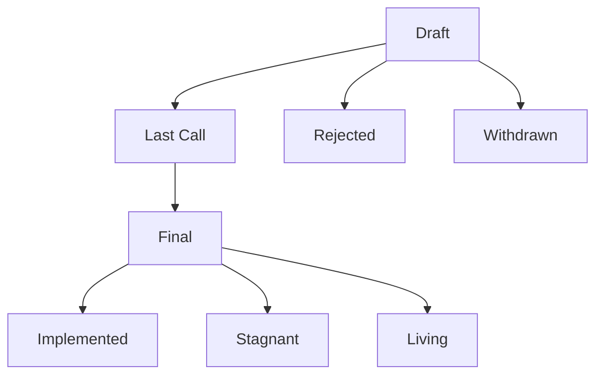
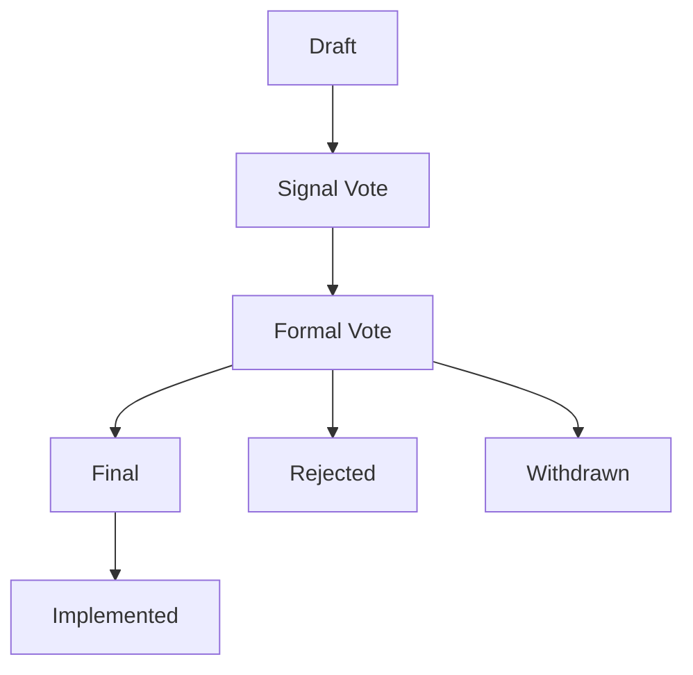

## **PIP-1 (PEACE COIN Improvement Proposal Guidelines)**

### **1. Purpose**

PEACE COIN Improvement Proposals (PIPs) constitute a standardized and transparent framework for submitting proposals related to the evolution, operation, and governance of the PEACE COIN PROTOCOL.  
Beyond technical and institutional design, PIPs function as a decision-making mechanism grounded in circulation—core principles for building a new economic society.

PEACE COIN is a new economic system that enables the smooth and fair circulation of values that have traditionally been invisible or undervalued by capitalism, such as trust, empathy, kindness, support, and voluntary actions.  
At the heart of this system lies **ARIGATO CREATION**, an increment/decrement algorithm, which is not merely a currency design but a tool to reconstruct the very structure of society.

PIPs serve the following purposes as a proposal system that evolves both the technology and the framework embodying these principles:
- Provide a standardized process for proposing improvements to the PEACE COIN PROTOCOL and related systems (e.g., wallets, SBTs, circulation mechanisms)  
- Offer a community-driven method for designing systems that naturally cultivate a future-oriented social awareness  
- Propose and promote systems for visualizing and circulating diverse values that should be fairly recognized and respected  
- Institutionalize the continuous evolution of circular economies, local empowerment, and value redistribution through DAO-based consensus  
- Form the foundational system supporting an open, evolving community where anyone can freely participate, connect, learn, and contribute

### **2. Types of PIPs**

#### 2.1 Standards Track PIP
**Purpose**: Covers proposals related to the core mechanisms and specifications of PEACE COIN, including protocol, token design, and interfaces. These define or revise the rules related to the system’s fundamental operations and the structure of value circulation.

- **Core**: Proposals related to the central protocol logic, including the ARIGATO CREATION algorithm for token increment/decrement, changes to its parameters, and the "r coefficient" (a variable for adjusting token value).  
*Example*: Contract specification changes, update logic for ARIGATO CREATION, design adjustments to the "r coefficient."
- **Application Interface**: Proposals related to the handling of tokens and associated data, including wallet UI, API design, user interactions, and integration with Dapps.
*Example*: Token display UI specs, authentication/access design for Web APIs.
- **Token & Community Design**: Proposals on the design of community tokens incorporating increment/decrement mechanisms, based on PCE (which itself has no such mechanisms), and proposals that define restrictions on their exchangeability to PCE (e.g., exchange ratios, conditions, and caps).
*Example*: Initial coefficient definition, exchange limitation structures.

**2.2 Process PIP**  
**Purpose**: Proposals related to the operational framework, including the decision-making processes, evaluation logic, and lifecycle of the PIP system and the DAO.  
*Example*: Revising proposal submission conditions, Signal Vote design, adjusting quorum and voting periods for Formal Votes, delegation system updates.

**2.3 Meta PIP**  
**Purpose**: Proposals that modify or expand the structure of the PIP system itself. These address the foundational aspects of the framework, such as adding or removing types, defining lifecycle stages, and designing templates.  
*Example*: Redefining PIP types, updating guidelines, standardizing document formats.

**2.4 Impact Indicators / Evaluation Design**  
**Purpose**: Proposals concerning the design, definition, and adjustment of values that should be visualized and evaluation metrics. The goal is to understand the impact of proposals from multiple angles and support consensus building and institutional design by asking: “What should be measured, and how should it be visualized?” 
- *Metrics Design (Examples of Indicators): Trust scores, redistribution and circulation rates, hidden emotional or contributory values, reaction scales based on empathy and sentiment.
- *Community Insight Map (Examples of Visualizations): Simulations of value circulation, impact comparisons before and after the proposal, distribution patterns of empathy and trust across regions or communities, and visualizations of network structures.

**2.5 Informational PIP**  
**Purpose**: Covers content that does not directly modify the system or protocol but contributes to community learning and informed decision-making. This includes knowledge sharing, experimental proposals, conceptual hypotheses, and case studies.  
*Example*: Prototype implementation reports, local DAO case studies, and sharing of algorithm evaluation tools.

---

### 3. Proposal Template
#### Required Information for Each PIP
- **Title**  
- **PIP Number**  (Auto-assigned)
- **Proposer**  
- **Submission Date**  
- **Status** (`Draft`, `Last Call`, `Final`, `Rejected`, `Withdrawn`, `Stagnant`, `Living`)
- **Type** (`Core`, `Application Interface`, `Token & Community Design`, `Process`, `Meta`, `Impact Indicators / Evaluation Design`, `Informational`)   
- **Motivation**  
- **Specification / Details**  
- **Contact** (Discord, GitHub, X, email, etc.)
- **Notes (optional)**:  
  - The need for SBT-based evaluation  
  - Scope of impact and potential risks  
  - Alternatives and rationale  
  - Start date and duration of the Signal Vote (see section 7 for details):  
    - A Signal Vote may commence no earlier than 48 hours after the proposal has been published as a Draft.  
    - Unless otherwise stated, the default voting period is 72 hours (3 days).
  - Last Call Deadline: `(e.g., 2025-08-17)`.
  - Requires (dependent PIP numbers, e.g., PIP-10, PIP-18)
You may include any other relevant supplementary information.

Editor: TBD (assigned during the review phase; responsible for ensuring compliance with the template and proper management of progress status)

You can find the official proposal template.  
[here](https://github.com/peace-coin/PIPs/blob/main/template***********.md)  

---

### **4. Lifecycle of a Proposal**

- **Draft**: Initial stage after publication; under discussion.
- **Last Call**: Final review period, typically with a 14-day window for final feedback.
- **Final**: Implemented or recognized as a standard specification.
- **Stagnant**: Automatically applied if no activity occurs for over 6 months.
- **Withdrawn**: Voluntarily withdrawn by the proposer. Cannot be resubmitted with the same PIP number.
- **Rejected**: Not approved due to lack of consensus or being deemed technically inappropriate.
- **Living**: Continuously updated proposals or specifications (e.g., governance rules or operational policies).

---

### **5. Submission Requirements**
All PIPs must meet the following criteria to be formally submitted and registered:

#### 5.1 Template Compliance
- The proposal must follow the designated format, with all required sections clearly stated.  
- Accuracy and transparency of the content are essential. While proposals may be written in any language if properly formatted, a full English version must be included if a language other than English is used.

#### 5.2 Eligibility of Proposers
PEACE COIN governance emphasizes participation based on **contribution**, **trust**, and **empathy**, not solely on financial capital.
- The following are considered naturally qualified to submit proposals:
    - Individuals involved in community activities, development, or operations  
    - Holders of a minimum qualifying amount of PCE (to be determined)  
    - Contributors to prototyping or testing efforts  

- In future iterations, qualification may also consider:
    - Activity history within the community  
    - Contribution records (e.g., past proposals, reviews, implementations)  
    - Delegated endorsements or trust from other members  

- **Governance Weighting in the Initial Phase**  
- *PCE Staking*: 1 PCE = 1 voting power  
- *Contributions via Tokens representing contributions (e.g., SBTs, NFTs, or similar mechanisms)*:  
  The rank is assigned at the time of issuance by governance members, and voting power is granted as follows:  
  - Rank 1: 25,000 voting power  
  - Rank 2: 75,000 voting power  
  - Rank 3: 150,000 voting power  
  - Rank 4: 200,000 voting power  
  - Rank 5: 300,000 voting power  
- Total voting power is determined by the sum of PCE staking and contribution-token-based voting power.
- PCE staking: 1 point
- Tokens representing contributions (e.g., SBTs, NFTs, or similar mechanisms): 1–5 points (types assigned by core team or moderators)
- Voting influence will be determined by the total sum of these points.

> Informational PIPs and proposals in the Draft stage can be freely submitted by anyone.  
The current system assumes that all participants have equal access to open proposal opportunities, and it is designed to remain flexible in alignment with future system evolution.
 
#### 5.3 Submission Platform
All PIPs must be submitted to the official platform (e.g., GitHub or Discourse).  
- Proposals must be posted publicly for community review.  
- Upon submission, proposals enter "Draft" status and may advance following community feedback.

#### 5.4 Review Period and Updates
A minimum review period of **72 hours** is required following Draft publication.  
- Updates must be tracked using **version control** (e.g., GitHub commits).

#### 5.5 Anti-Abuse and Resubmission Policy
- Proposals containing spam, offensive content, irrelevant promotions, or content that violates community norms may be rejected by moderators or based on the community guidelines.  
- Even if a proposal is rejected, it may be **resubmitted** after appropriate revision.

---

### **6. Evaluation & Visualization Criteria**
PIPs emphasize not only technical or institutional changes but also the importance of visualizing and evaluating the social, cultural, and economic value that a proposal may generate.  
This helps enable multifaceted understanding, build consensus, and prioritize actions.

#### 6.1 Impact Indicators
Proposals are encouraged to outline expected impact areas and evaluation metrics.  
Examples include:
- Effects on trust scores (e.g., formation of new trust networks, enhancement of scoring systems)  
- Visualization of empathy (e.g., reactions via Signal Vote or feedback on submission)  
- Changes in circulation or redistribution (e.g., transaction volume or usage frequency)  
- Impact indicators for latent or potential value (e.g., less-visible contributions or emotional responses)

#### 6.2 Suggested Visualization Methods
Where feasible, proposers are encouraged to include visual or quantitative representations such as:
- Circulation simulations (e.g., modeled redistribution under new rules)  
- Mapping of support (e.g., which regions or groups show alignment)  
- Comparative data (e.g., Before/After effects or regional comparisons)  
> These may be prepared by the proposer or supplemented collaboratively by community members.

#### 6.3 Purpose
The goal of this evaluation and visualization framework is to:
- Support decision-making using diverse indicators, including qualitative values  
- Build a repository of insights to improve future proposals or resubmissions  
> Evaluation and visualization are *not mandatory*, but including them can help build trust with the community and is expected to increase the likelihood of approval in the Formal Vote stage.

---

### **7. Voting & Consensus**
Decision-making in PEACE COIN follows a consensus-building process that progresses in stages, depending on the nature of the proposal.

#### **Proposal Flow:**

#### **1. Signal Vote**
Draft proposals can proceed to a Formal Vote after visualizing initial support for their direction through a Signal Vote using reactions such as 👍 or 👎 on platforms like Discord or GitHub.
- A minimum of 48 hours must pass after Draft publication before initiating a Signal Vote.  
- Unless otherwise specified, Signal Vote duration is set to 72 hours.
- Voting records must be preserved (e.g., screenshots or GitHub comment logs).

#### **2. Formal Vote**
This is the official voting phase conducted by the DAO.
For a vote to be considered valid, the following two conditions must be met:
- Quorum: the number of valid votes must exceed a certain percentage of all governance participants.
- Approval Rate: the percentage of affirmative votes among valid votes must meet or exceed the threshold defined for each type.

| Type                             | Quorum         | Approval Rate    | Notes                                                                 |
|--------------------------------------|----------------|------------------|-----------------------------------------------------------------------|
| **Core**                             | 20% or more    | 66% or more       | Core specifications; protocol and ARIGATO CREATION                   |
| **Application Interface**            | 20% or more    | Majority          | Design for UI, API, and Dapp integration                             |
| **Token & Community Design**         | 20% or more    | Majority          | Token structure and exchangeability restrictions                     |
| **Process**                          | 20% or more    | Majority          | Proposal submission, voting design, delegation system                |
| **Meta**                             | 20% or more    | 66% or more       | Rule-setting related to PIP type definitions and structural changes    |
| **Impact Indicators / Evaluation Design** | 20% or more | Majority          | Metrics design, circulation simulations, empathy visualization, etc. |
| **Informational**                    | 10% or more    | Majority          | Knowledge sharing, reports, and other non-governance-impacting content |

#### **3. Rejection, Resubmission, Withdrawal**
- Proposals that do not meet the approval criteria during the Formal Vote will be recorded as **Rejected**.
- Proposers may revise the content and **resubmit** it as a new Draft.
- Proposers may also **Withdraw** their proposals voluntarily at any time.

---

### **8. Implementation & Follow-up**
Once a PIP is approved, it moves into the implementation phase to ensure that its contents are reflected in reality. At this stage, concrete actions are required to realize the intent of the proposal—such as technical development, procedural arrangements, and pilot implementation within the community.

#### Examples of Implementation Tasks:
- Modifying smart contracts or wallet settings  
- Updating the trust score evaluation logic  
- Applying to localized community rules  
- Updating and disseminating related documents or templates  

#### Operational Follow-up:
- Tracking the changes resulting from the proposal (e.g., circulation rate, empathy indicators)  
- Collecting feedback on bugs or operational issues  
- Creating guides or reports for expansion to other communities  

Implementation responsibilities are shared flexibly among proposers, developers, governance members, or local operational teams—according to their roles.

---

### **9. Amendments & Meta-Governance**
This section defines how the foundational rules of the PIP system—such as the design of trust scores, voting mechanisms, and procedural structures—can be revised. These are not ordinary proposals but meta-level updates that underpin the autonomous and evolving nature of PEACE COIN governance.

#### Key Areas Subject to Meta-Governance:
- Changes to PIP types, statuses, and lifecycle  
- Review and redesign of contribution scoring mechanisms using Contribution Tokens (e.g., SBTs, NFTs)  
- Revision of quorum rules or vote weighting mechanisms  
- Adjustments in DAO structure or distribution of decision-making authority  

#### Required Conditions:
- Higher quorum and approval threshold than standard PIPs (e.g., 66% majority)  
- Review or endorsement by high-trust-score participants  
- Gradual rollout with testing or impact evaluation when possible  

This mechanism ensures that even as PEACE COIN’s technologies evolve, the system can autonomously adapt and grow while preserving its integrity.

---

### **10. Licensing & Copyright**
PEACE COIN Improvement Proposals (PIPs) are intended as a public intellectual infrastructure that anyone can propose, reference, reuse, or implement freely. Accordingly, all PIP documents follow the policy below:

#### Basic Policy
PIPs are, by default, published under the **[Creative Commons CC0 1.0 Universal](https://creativecommons.org/publicdomain/zero/1.0/)** (Public Domain) license.  
This allows anyone to copy, modify, distribute, and use the content freely without attribution or permission.

#### License and Usage Rights
> Unless otherwise specified, all PIP documents are released under the CC0 1.0 Universal license.  
You are free to copy, modify, distribute, and use the content for any purpose without attribution.

#### Exceptions & Explicit Restrictions
Proposers may specify a different license, which must be clearly stated at the beginning of the document.  
However, CC0 is strongly recommended to facilitate reuse, translation, and integration.

#### Respect for Intellectual Contribution and Principles of Co-Creation
PIPs are built on the belief that *“a proposal can spark action and evolve society.”*  
To support open sharing of intellectual contributions and the creation of circular value through adaptation and development, licensing freedom plays a crucial role.
